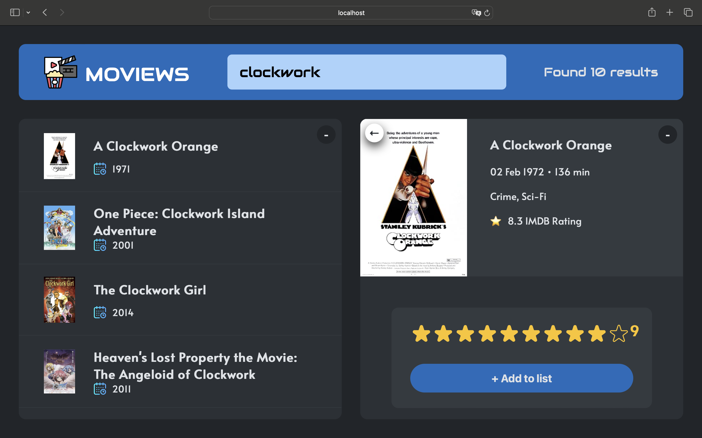
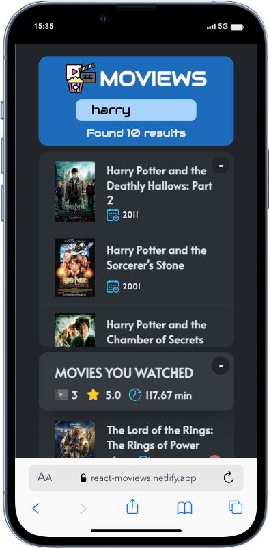

# MOVIEWS

[https://react-moviews.netlify.app/](https://react-moviews.netlify.app/)

A responsive web application built in React for tracking movies you've watched.

## Features

- **Search Functionality**: Allows users to search for movies from an API.
- **Movie Selection**: Users can select a movie to view its details.
- **Add to Watchlist and rate**: Add movies to a personalized watchlist with rating.
- **Watched Movies Summary**: Overview of watched movies.
- **Error Handling**: Displays error messages for unsuccessful operations.
- **Responsive Design**: Adaptative UI for different screen sizes.

## React Concepts and Hooks Used

- **Functional Components**: The app is built using functional components.
- **React Hooks**: Implements `useState`, `useEffect`, and `useCallback` for state management and side effects and also custom hooks.
- **OMDB API**

## Mobile View

